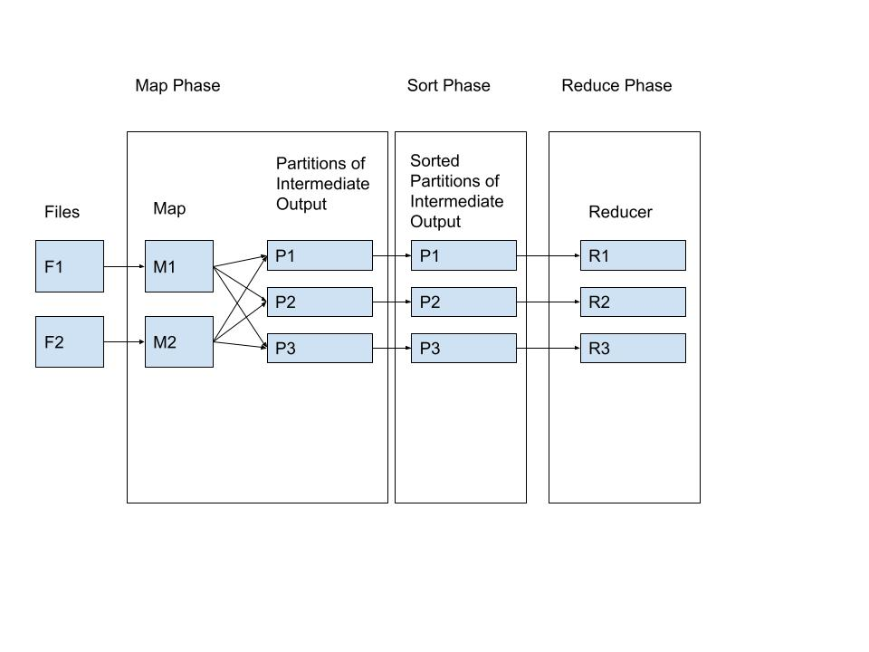
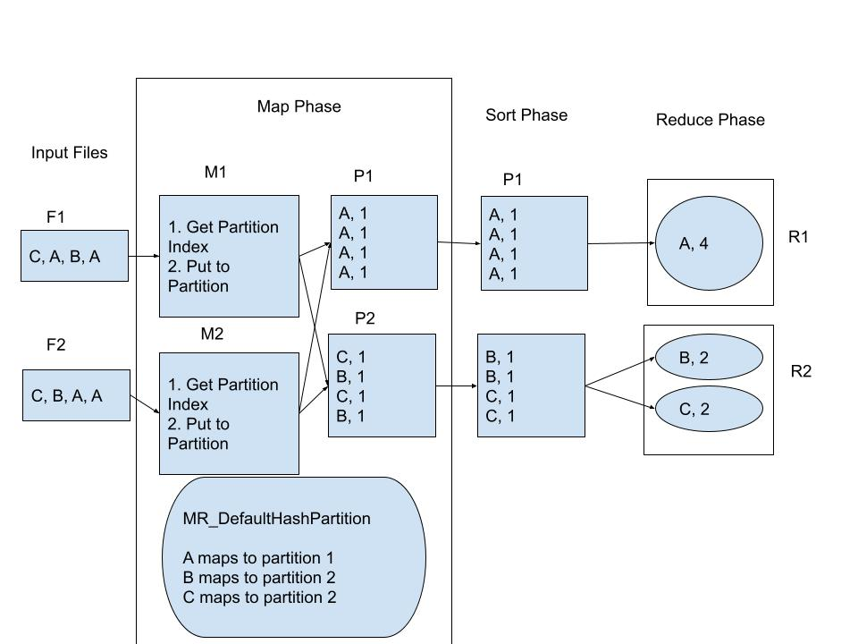

# COMP SCI 537 Discussion Week 8

## Important: This discussion write-up is intended to serve as a general guide to P4. You must read the project spec carefully _before_ reading this guide. 

## Map Reduce - What is it?

MapReduce is a programming paradigm that makes programming large-scale parallel data processing tasks simple for developers. Instead of worrying about parallelism, efficiency and other complexities - the developer just has to write some simple functions (as explained below) and the infrastructure handles the rest. 

In this project, you will be implementing the MapReduce framework itself. So in this scenario, you are not the developer running their data-processing tasks - you are the heroic systems expert who's making an easy-to-use **library** for the developer to run these tasks. So while the grateful developers who use your library and API will not have to worry about threads, locks and concurrency - you definitely will!

First, let's break down what Map and Reduce really mean. The MapReduce paradigm states that computations can be programmed in a simple functional style consisting of a _Map_ and a _Reduce_ phase. 

* Users specify a _Map_ function that processes a key/value pair to generate a set of intermediate key/value pairs.
* Users specify a _Reduce_ function that merges intermediate values associated with the same intermediate key.

## A popular example

This can be better understood via the canonical example generally used to explain MapReduce - the wordcount program. This example is covered extensively in the project spec - which you should read first before proceeding.

```c
#include <assert.h>
#include <stdio.h>
#include <stdlib.h>
#include <string.h>
#include "mapreduce.h"

void Map(char *file_name) {
    FILE *fp = fopen(file_name, "r");
    assert(fp != NULL);

    char *line = NULL;
    size_t size = 0;
    while (getline(&line, &size, fp) != -1) {
        char *token, *dummy = line;
        while ((token = strsep(&dummy, " \t\n\r")) != NULL) {
            MR_Emit(token, "1");
        }
    }
    free(line);
    fclose(fp);
}

void Reduce(char *key, Getter get_next, int partition_number) {
    int count = 0;
    char *value;
    while ((value = get_next(key, partition_number)) != NULL)
        count++;
    printf("%s %d\n", key, count);
}

int main(int argc, char *argv[]) {
    MR_Run(argc, argv, Map, 10, Reduce, 10, MR_DefaultHashPartition);
}
```

* In the _Map_ function, we open each file and emit a key-value pair for each word found, where the key is the word itself and the value is the number "1" that represents one occurrence of the word being found.
* In the _Reduce_ function, the key-value pairs generated are merged by adding all the values corresponding to a single key to obtain a key value pair where the key is the word itself and the value is the number of occurrences.
* The _MR_Run_ function specifies that we need to run 10 Map tasks (threads) and 10 Reduce tasks. Each mapper tasks emits its tokens to the same `hashmap`, hence designing this data structure is one of the main challenges of this project and an important step in our implementation.



### Map Phase:

1. Each Mapper thread (M1 and M2 in figure) reads from a separate file. Say there are two threads and two files, then each thread will concurrently read data from 1 file assigned to it during the thread's creation. The filenames are passed as arguments to the main function, and eventually passed as function arguments to the mapper thread.

2. Each mapper thread needs to store it's intermediate output in a data structure where the corresponding reducer threads can find it. If we used one global data structure to store all intermediate key-value pairs, all the mappers would contend to obtain a lock on this data structure. This would reduce our parallel implementation to a sequential one. To avoid this, we use partitions. Each mapper thread (M1 and M2 in figure) produces intermediate output to all partitions. 

4. Now, we need a mechanism for the Mapper thread to know which partition to send a particular intermediate output to. For this, we use a partitioner function. The mapper thread will ask the partitioner function - say `MR_DefaultHashPartition`, to find the partition index of an input key. The partitioner function returns an index corresponding to a key (For example, a word 'systems' is provided as a key to the function and it returns an index '5') . That index will determine the partition index for a particular input key. 

Aside: Think about why we partition based on the key? What benefit do we get from storing all the key-value pairs for the same key in the same partition? (The answer is revealed later in this document)

3. Now, since two mapper threads can write to the same partition, you may want to use `pthread_mutex_t` for each partition so that only one thread can write to one partition at a time. If you observe garbage values in a partition, that is a likely indicator that the locking was not implemented correctly. Note that since the lock is per-partition, M1 should be able to write to partition P1 and M2 should be able to write to partition P3 concurrently. Thus, different mappers should be able to concurrently access different partitions at a time.


### Sort Phase

1. In this phase we simply need to sort partitions so the reducer tasks can be run on the intermediate output. This phase is simple: Run a for-loop that sorts the contents of each partition, one at a time. The partitions are to be sorted _internally_, i.e. we are sorting the key-value pairs located within a partition, we are not sorting the global intermediate outputs stored across partitions.

2. After this phase, we obtain internally sorted partitions to be consumed by reducer threads.

### Reduce Phase
1. The number of reducer threads corresponds to the number of partitions.

2. Each reducer thread will first pick a key and read intermediate output entries of a key. It will run its reduction function on a key. Since the Reducer function is supplied as argument to your library, we - as library developers have no control over how final output is consumed.

### Example

Now, let’s revisit our wordcount example and see how this abstraction works.

Map phase : File F1 contains the single-letter words C, A, B, A and F2 contains the words C, B, A, A. 

Thread M1 does the following tasks:
- Reads all entries from F1.
- For each input, it gets the index of each key (A, B or C) from MR_DefaultHashPartition to determine which partition the intermediate output is to be sent to. 
- The intermediate ouput is: (C, 1), (A,1 ), (B, 1), (A,1). These outputs are pushed to their corresponding paritions. Note that all entries of A are in partition P1, all entries of B and Care in partition P2.

Sort phase : Simply sort all entries inside a partition. Note that all B’s are before C’s in partiion P2.

Reduce phase : Reducer thread will pick one key at a time and run the user-provided reduction function on it. Note that reducer thread R2 will first pick key B, run reduction function on it and then pick key C and run reduction function on it. That’s why we have two ovals in R2 indicating that it picks one key at a time.




## Partitioning

What is a partition? Why is it needed?
As mentioned earlier- if there are no partitions and all mappers write to a single list, then the mappers’ execution becomes sequential because they’ll have to compete for taking a lock on that single list. Mapper threads will waste time waiting for that lock.

So, to avoid sequentialization, we should have multiple lists. Each list can be seen as a partition which is accessed by all the mappers and reducers.

However, we’re not simply partitioning data, we’re doing that in an intelligent way. MR_Emit() will decide in which partition the data should be stored. For example, the same key( word in example above) will always be stored in the same partition. 

This way, the reducers work is lessened because reducer needs to find all key-value pairs for a particular key and it no longer needs to go through all partitions for finding the same.  Our intelligent partitioning ensures all key-value pairs of a particular key go to the same partition. Also, there’s no need to perform global sort across all partitions. Note that global sort would be much more costly than several local per-partition sort. Our partitioning enables a reducer thread to access only one partition for reduction on a key.

Think about the case where each partition resides on a different server in your network. Not storing intermediate values in this manner would result in a lot of data being sent back-and-forth across the network, resulting in unneccessary costs and delays known as _overhead_. In systems, we do our best to keep _overhead_ as low as possible.


## Read / Write Locks

In this project, you also need to modify an existing HashMap implementation to be multi-threaded using reader-writer locks. 

Why do we need to do this (apart from the fact we asked you to, and it's fun)?
- This stems from the logic that we can safely allow lookups or simple reads on a data structure concurrently as long as no write operation is ongoing. A traditional lock would block even concurrent reads and allow for less efficient code than when using a R/W lock.


### Read Lock API:
The pthread_rwlock_rdlock() function shall apply a read lock to the read-write lock referenced by rwlock. The calling thread acquires the read lock if a writer does not hold the lock and there are no writers blocked on the lock.
```c
int pthread_rwlock_rdlock(pthread_rwlock_t *rwlock);
```
### Write Lock API:

The pthread_rwlock_wrlock() function shall apply a write lock to the read-write lock referenced by rwlock. The calling thread acquires the write lock if no other thread (reader or writer) holds the read-write lock rwlock. Otherwise, the thread shall block until it can acquire the lock. The calling thread may deadlock if at the time the call is made it holds the read-write lock (whether a read or write lock).

```c
int pthread_rwlock_wrlock(pthread_rwlock_t *rwlock);
```
### Common Un-Lock API:
The pthread_rwlock_unlock() function shall release a lock held on the read-write lock object referenced by rwlock. Results are undefined if the read-write lock rwlock is not held by the calling thread.
```c
int pthread_rwlock_unlock(pthread_rwlock_t *rwlock);
```

## Good luck for P4!
